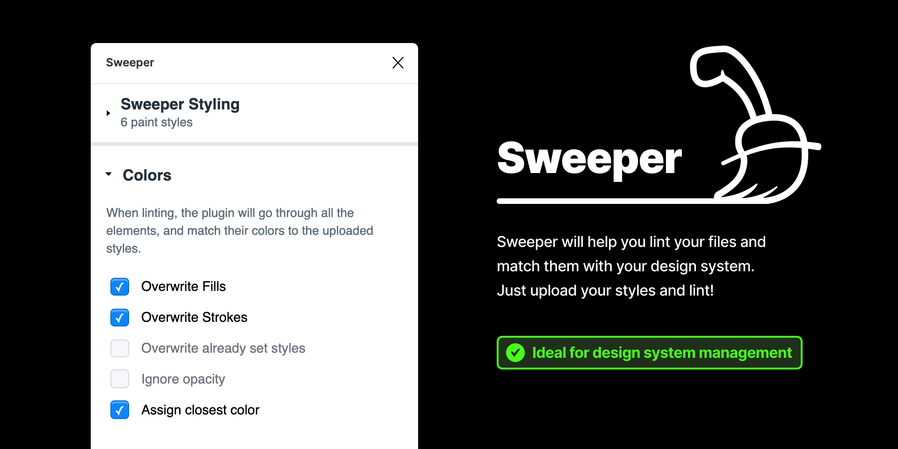

  

Figma plugins can be very simple, or as complex you want them to be. This Figma plugin boilerplate is opinionated and is optimized for a feature rich and larger plugins. It is heavily inspired from [viewports-client](https://github.com/rojcyk/viewports-client).

### Dependencies

- It is written in [Typescript](https://www.typescriptlang.org/).
- The code follows [Prettier](https://github.com/prettier/prettier) styling.
- It uses [Webpack](https://webpack.js.org/) to create a bundle.
- It is a [React App](https://reactjs.org/).
- And the components are styled with [styled-components](https://github.com/styled-components/styled-components) 🤯
